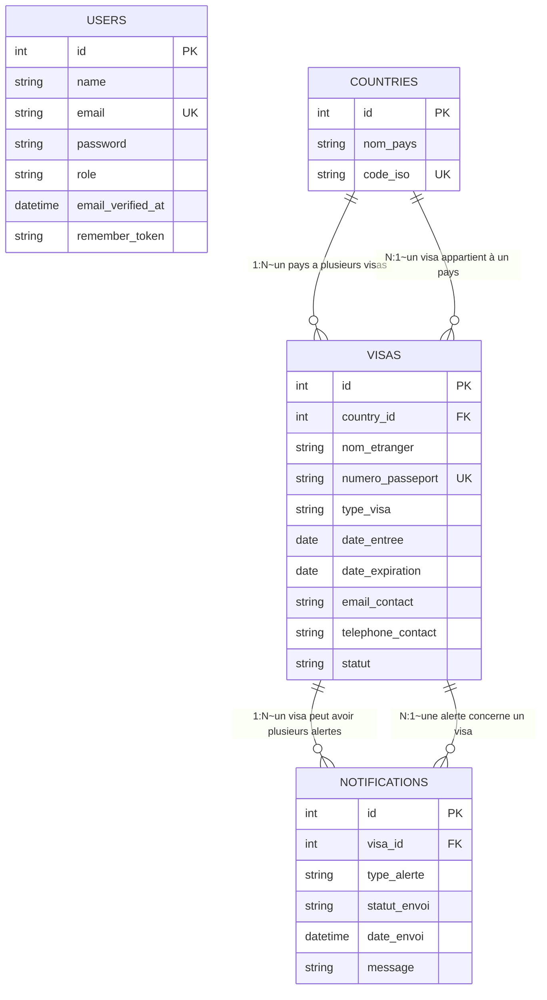
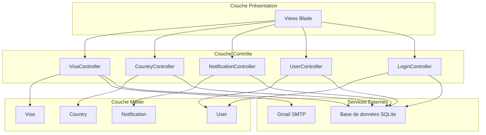

# Diagramme de Classes - Projet ANAFI

## Vue d'ensemble

Le projet ANAFI est une application Laravel pour la gestion des séjours et visas des ressortissants étrangers en RDC (Direction Générale de la Migration).

## Diagramme de Classes avec Multiplicités

```mermaid
classDiagram
    %% Héritage des classes Laravel
    class Controller {
        <<abstract>>
        +index()
        +create()
        +store()
        +show()
        +edit()
        +update()
        +destroy()
    }
    
    class VisaController {
        +index()
        +dashboard()
        +create()
        +store()
        +show()
        +avertissement()
        +envoyerAlerte()
    }
    
    class CountryController {
        +index()
        +create()
        +store()
        +show()
        +edit()
        +update()
        +destroy()
    }
    
    class NotificationController {
        +index()
    }
    
    class UserController {
        +index()
        +create()
        +store()
        +destroy()
    }
    
    class LoginController {
        +showLoginForm()
        +login()
        +logout()
    }
    
    class User {
        <<entity>>
        +id: int PK
        +name: string
        +email: string UK
        +password: string
        +role: string
        +email_verified_at: datetime
        +remember_token: string
        +isAdmin() bool
    }
    
    class Country {
        <<entity>>
        +id: int PK
        +nom_pays: string
        +code_iso: string UK
        +visas() HasMany
    }
    
    class Visa {
        <<entity>>
        +id: int PK
        +country_id: int FK
        +nom_etranger: string
        +numero_passeport: string UK
        +type_visa: string
        +date_entree: date
        +date_expiration: date
        +email_contact: string
        +telephone_contact: string
        +statut: string
        +country() BelongsTo
        +notifications() HasMany
    }
    
    class Notification {
        <<entity>>
        +id: int PK
        +visa_id: int FK
        +type_alerte: string
        +statut_envoi: string
        +date_envoi: datetime
        +message: string
        +visa() BelongsTo
    }
    
    class AlertExpiration {
        +details: array
        +__construct()
        +build()
    }
    
    class AdminMiddleware {
        +handle()
    }
    
    class Authenticate {
        +handle()
    }
    
    %% Relations d'héritage
    Controller <|-- VisaController
    Controller <|-- CountryController
    Controller <|-- NotificationController
    Controller <|-- UserController
    Controller <|-- LoginController
    
    %% Relations entre modèles avec multiplicités
    Country "1" --> "*" Visa : "a plusieurs~1:N~"
    Visa "1" --> "1" Country : "appartient à~1:1~"
    Visa "1" --> "*" Notification : "génère~1:N~"
    Notification "1" --> "1" Visa : "concerne~1:1~"
    
    %% Relations avec les contrôleurs
    VisaController --> Visa : "gère~1:N~"
    VisaController --> AlertExpiration : "envoie"
    VisaController --> Notification : "enregistre~1:N~"
    CountryController --> Country : "gère~1:N~"
    NotificationController --> Notification : "gère~1:N~"
    UserController --> User : "gère~1:N~"
    LoginController --> User : "authentifie~1:1~"
```

## Schéma des Relations avec Multiplicités



## Tableau des Multiplicités

| Relation | Entité 1 | Entité 2 | Type | Description |
|----------|----------|----------|------|-------------|
| Country → Visa | 1 | N | 1:N | Un pays peut avoir plusieurs visas |
| Visa → Country | 1 | 1 | 1:1 | Un visa appartient à un seul pays |
| Visa → Notification | 1 | N | 1:N | Un visa peut générer plusieurs alertes |
| Notification → Visa | 1 | 1 | 1:1 | Une alerte concerne un seul visa |

## Modèles de Données Détaillés

### User (Utilisateur) - 1 entité

| Attribut | Type | Contrainte | Description |
|----------|------|------------|-------------|
| id | integer | PK | Identifiant unique |
| name | string | NOT NULL | Nom de l'utilisateur |
| email | string | NOT NULL, UNIQUE | Adresse email |
| password | string | NOT NULL | Mot de passe hashé |
| role | string | NOT NULL | Rôle (admin, agent) |
| email_verified_at | datetime | NULLABLE | Date de vérification |
| remember_token | string | NULLABLE | Token de session |

### Country (Pays) - 1:N avec Visa

| Attribut | Type | Contrainte | Description |
|----------|------|------------|-------------|
| id | integer | PK | Identifiant unique |
| nom_pays | string | NOT NULL | Nom du pays |
| code_iso | string | UNIQUE | Code ISO 3166 |

**Multiplicité :** 1 Country → * Visa (Un pays peut avoir plusieurs visas)

### Visa (Séjour/Visa) - N:1 avec Country, 1:N avec Notification

| Attribut | Type | Contrainte | Description |
|----------|------|------------|-------------|
| id | integer | PK | Identifiant unique |
| country_id | integer | FK → Country | Référence pays |
| nom_etranger | string | NOT NULL | Nom complet |
| numero_passeport | string | NOT NULL, UNIQUE | Numéro passeport |
| type_visa | string | NOT NULL | Type de visa |
| date_entree | date | NOT NULL | Date d'entrée |
| date_expiration | date | NOT NULL | Date d'expiration |
| email_contact | string | NOT NULL | Email de contact |
| telephone_contact | string | NOT NULL | Téléphone |
| statut | string | NOT NULL | Statut |

**Multiplicités :**
- Visa → Country : 1:1 (Un visa appartient à un seul pays)
- Visa → Notification : 1:N (Un visa peut générer plusieurs alertes)

### Notification (Alerte) - N:1 avec Visa

| Attribut | Type | Contrainte | Description |
|----------|------|------------|-------------|
| id | integer | PK | Identifiant unique |
| visa_id | integer | FK → Visa | Référence visa |
| type_alerte | string | NOT NULL | Type (Email, SMS) |
| statut_envoi | string | NOT NULL | Statut envoi |
| date_envoi | datetime | NOT NULL | Date d'envoi |
| message | string | NOT NULL | Message |

**Multiplicité :** Notification → Visa : 1:1 (Une alerte concerne un seul visa)

## Architecture du Projet



## Résumé des Multiplicités

```
┌─────────────┐       1:N       ┌─────────────┐
│  COUNTRY    │─────────────────│    VISA     │
└─────────────┘                 └──────┬──────┘
                                        │
                                       1:1
                                        │
                                        ▼
                                 ┌─────────────┐
                                 │NOTIFICATION│
                                 └─────────────┘
                                 
Légende:
- 1:N : Un pays a plusieurs visas
- 1:1 : Un visa appartient à un pays / Une alerte concerne un visa
- 1:N : Un visa peut générer plusieurs alertes
```
